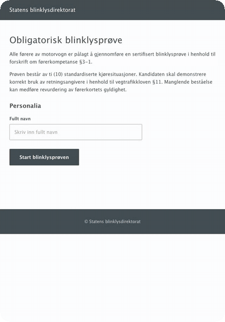
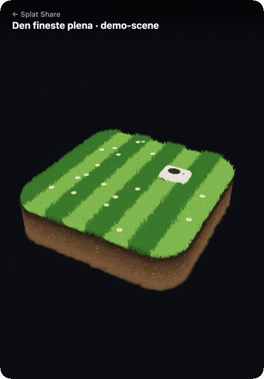

### Hei, Eirik her.

Jeg synes datamaskiner er kult. Spesielt å trykke på knapper, og så bare skjer det ting. Woow. Boom. Akkurat nå står ei ny side til heving, og snart er den ferdigstekt. Utenfor skjermen er jeg gressentusiast, alltid på jakt etter den fineste plena. Jeg hater byråkrati, men har likevel startet [et direktorat](https://blinklysprove.vercel.app).

## Utstillingen

<table>
<tr>
<td width="33%" valign="top">

<h3>Blinklysprøven</h3>

Statens Blinklysdirektorat har innført obligatorisk blinklysprøve for alle bilister. Ti saker, null nåde. Glemmer du å blinke, havner du i fengsel.

<a href="https://blinklysprove.vercel.app"><b>Ta prøven →</b></a> &nbsp;·&nbsp; <a href="https://github.com/Aflekt/blinklysprove">kildekode</a>

</td>
<td width="33%" valign="top">

<h3>Splat Share</h3>

Last opp en Gaussian splat og få en kort lenke med 3D-viewer, QR-kode og embed til Finn-annonsen. For boligfotografer som er lei av å sende .ply-filer på e-post.

Plena er laget i kode, 295 000 splats.

<a href="https://splat-share.vercel.app"><b>Prøv den →</b></a>

</td>
<td width="33%" valign="top">

<h3>Sak 0917</h3>

Under etterforskning. Mer kan vi ikke si akkurat nå. Men det lukter litt surt.

Kommer til aflekt.no

</td>
</tr>
</table>

## Toolbox

 

Husk å blinke.

